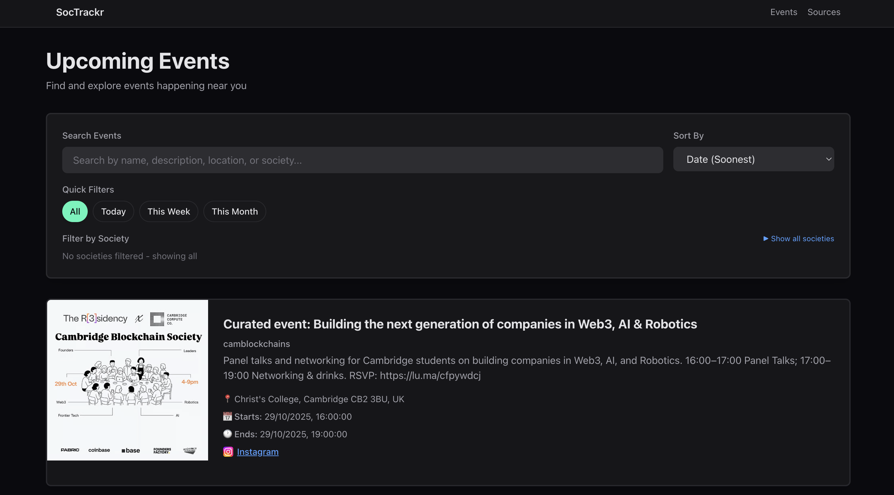
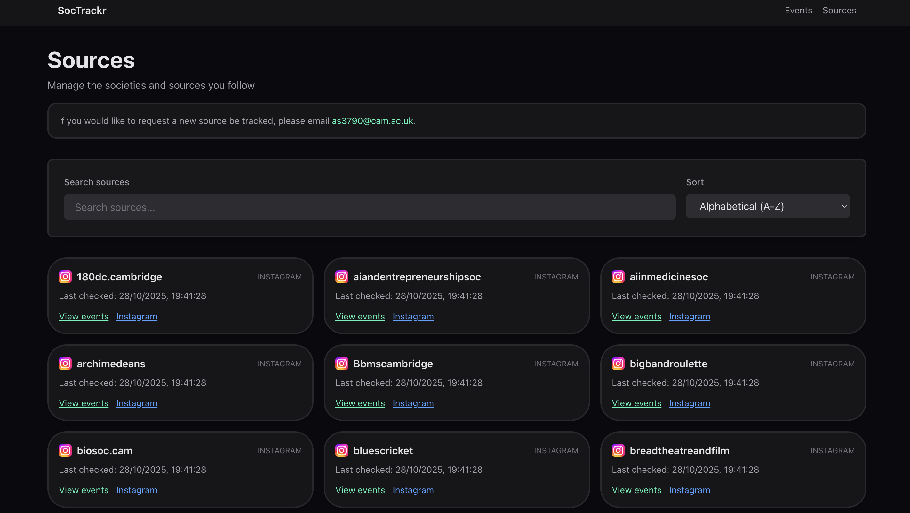

# SocTrackr
[SocTrackr](https://www.soctrackr.com/)

## An app which aggregates event data from multiple sources and presents everything in one place

Built to manage all the events across different societies in my university.

## How it works

- Run a Python scrapping script daily which iterates through all saved sources (Instagram handles) and finds new posts since a given last-checked-timestamp.
- These new posts are then passed through an LLM to determine whether they contain information about any upcoming events, and if so these events are returned with name, location and timestap (alongside some other infromation).
- Events are then stored in a database, which is then accessed by the frontend NextJS app.
- Frontend displays all upcoming events, providing ability to filter and search for given event types

## Stack 
- Python backend
- NextJS frontend
- Events are stored in sqlite, but are currently converted to JSON files to be read in NextJS (as NextJS does not support sqlite in production)
- Apify for Instagram scraping
- OpenAI GPT for LLM

## Previews

## Todo
- Add more source types, e.g. email, Whatsapp, Discord, etc...; could make use of MCPs to get this done
- Add better erecommendation systems so people can see what events are on